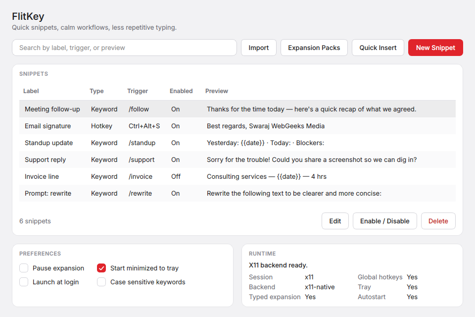

<div align="center">
  
  <h1>FlitKey</h1>
  <p><strong>A free, offline, modern desktop text expander for Linux and Windows.</strong></p>
  <p>
    FlitKey turns short triggers into reusable snippets, templates, and dynamic text instantly using typed keywords, global hotkeys, or a searchable quick-insert picker. Operates 100% locally with zero cloud dependencies, native keyboard integration, and built-in expansion packs.
  </p>
  <p>
    <a href="#quick-start">Quick Start</a> ·
    <a href="#key-features">Key Features</a> ·
    <a href="#interface--demo">Interface</a> ·
    <a href="#platform-support">Platform Support</a> ·
    <a href="#expansion-packs">Expansion Packs</a> ·
    <a href="#dynamic-placeholders">Placeholders</a> ·
    <a href="#faq">FAQ</a> ·
    <a href="#security-and-privacy">Security</a> ·
    <a href="#license">License</a>
  </p>
  <p>
    <a href="https://github.com/swarajnandedkar/FlitKey/actions/workflows/tests.yml"></a>
    <a href="https://www.python.org/"></a>
    <a href="#platform-support"></a>
    <a href="https://www.riverbankcomputing.com/software/pyqt/"></a>
    <a href="#expansion-packs"></a>
    <a href="LICENSE"></a>
  </p>
</div>

---

## Quick Reference & Tech Specs

| Specification | Details |
| --- | --- |
| **Language** | Python 3.10+ |
| **GUI Framework** | PyQt6 |
| **Compatible Platforms** | Linux (X11 & Wayland) and Windows 10/11 (64-bit) |
| **Supported Displays / Backends** | X11 (`xinput`/`xdotool`), Wayland (Clipboard Fallback), Windows (`SetWindowsHookEx`/`SendInput`) |
| **Dependencies** | `python3-pyqt6`, `xdotool`, `xinput`, `x11-xserver-utils`, `xclip` (Linux X11) |
| **Configuration Path** | `~/.config/flitkey/config.json` (Linux) / `%APPDATA%\flitkey\config.json` (Windows) |
| **License** | [MIT License](LICENSE) |
| **Current Version** | `0.6.0` |

---

## Key Features <a id="key-features"></a>

* **📦 Built-in Expansion Packs**: Instant 1-click access to curated snippet packs for AI Chatbot prompts, Developers, Designers, Customer Support, DevOps, and Everyday Productivity.
* **⚡ Typed Keyword Triggers**: Automatically detects typed keywords inline (e.g., `:gcm`, `:stamp`) and expands them immediately.
* **🔍 Searchable Quick Insert**: Global overlay window (`Ctrl+Shift+Space`) to quickly search, filter, and insert snippets on demand.
* **⌨️ Global Hotkeys**: Trigger expansions with customizable key combinations (e.g., `Ctrl+Alt+A`).
* **🪄 Dynamic Placeholders**: Expand variables like date, time, system clipboard contents, or specify post-expansion cursor placement (`{{cursor}}`).
* **🔄 Multi-Format Importer**: Easily import existing snippets from **Espanso** (`.yml`), **AutoHotkey** (`.ahk`), **CSV/TSV**, and **JSON**.
* **🛡️ 100% Local & Offline**: All snippets and settings stay on your machine. Zero cloud accounts, zero telemetry, zero background network calls.
* **🪟 System Tray Integration**: Background tray menu for quick insert, pause/resume expansion, and preferences.
* **🌐 Cross-Platform & Browser Support**: Native support for Linux and Windows, plus an optional Manifest V3 Chrome Extension.

---

## Interface & Demo <a id="interface--demo"></a>

### Main Window & Snippet Manager


### Snippet Expansion in Action


---

## Platform Support Matrix <a id="platform-support"></a>

FlitKey automatically probes your current desktop session and selects the appropriate runtime backend:

| Feature / Session | X11 Desktop | Wayland Desktop | Windows (10/11) | Browser Extension | Technical Mechanism |
| --- | --- | --- | --- | --- | --- |
| **Typed Keyword Expansion** | ✅ Yes | ⚠️ Clipboard Mode | ✅ Yes | ✅ Web Inputs | `xinput test-xi2` (Linux) / `SetWindowsHookEx` (Windows) / DOM events |
| **Global Hotkeys** | ✅ Yes | ⚠️ Restricted | ✅ Yes | ❌ Browser-only | `xdotool` (Linux) / Windows Key Hooks |
| **Searchable Quick Insert** | ✅ Yes | ✅ Clipboard Mode | ✅ Yes | ✅ Extension Popup | Pastes text or copies to clipboard via `QClipboard` / `SendInput` |
| **System Tray Controls** | ✅ Yes | ✅ Yes | ✅ Yes | ❌ N/A | PyQt6 `QSystemTrayIcon` |
| **Autostart at Login** | ✅ Yes | ✅ Yes | ✅ Yes | ❌ N/A | XDG Autostart `.desktop` entry (Linux) / Windows Registry |

> **Note on Wayland:** Wayland's security model isolates applications from monitoring global keystrokes and simulating input. FlitKey gracefully handles Wayland via its **Quick Insert** clipboard workflow: snippets selected from the picker are copied to your clipboard with a desktop notification so you can paste them anywhere.

---

## Installation & Quick Start <a id="quick-start"></a>

### Method 1: Install via Debian/Ubuntu Package (Recommended for Linux)

1. Build the Debian package:
   ```bash
   python3 build_deb.py
   ```
2. Install the package:
   ```bash
   sudo apt install ./dist/flitkey_0.6.0_all.deb
   ```
3. Run the application:
   ```bash
   flitkey
   ```
*The package installs the application to `/opt/flitkey`, creates a binary launcher at `/usr/bin/flitkey`, and registers desktop entries and icons.*

---

### Method 2: Run from Source (Linux & Windows)

1. **Clone the repository:**
   ```bash
   git clone https://github.com/swarajnandedkar/FlitKey.git
   cd FlitKey
   ```

2. **Linux prerequisites (Ubuntu/Debian):**
   ```bash
   sudo apt update
   sudo apt install python3 python3-pyqt6 xdotool xinput x11-xserver-utils xclip
   ```

3. **Windows prerequisites:**
   ```cmd
   pip install -r requirements-windows.txt
   ```

4. **Launch FlitKey:**
   ```bash
   python3 run.py
   ```

5. **Start minimized to the system tray:**
   ```bash
   python3 run.py --minimized
   ```

6. **Create a local Linux desktop launcher shortcut:**
   ```bash
   python3 install.py
   ```

---

### Method 3: Windows 10/11 Standalone Build

FlitKey includes a native Windows backend for typed keyword expansion, global hotkeys, Unicode text insertion, system tray controls, and per-user startup.

To build the self-contained 64-bit Windows installer:
```cmd
python build_windows.py
```
*Note: Unsigned releases may show a Microsoft Defender SmartScreen warning on first launch ("Unknown Publisher"). See [WINDOWS.md](WINDOWS.md) for build instructions, code signing configuration, and SmartScreen safety details.*

---

### Method 4: Chrome Browser Extension

FlitKey also includes a standalone Manifest V3 Chrome Extension located in the `chrome_extension/` directory:

1. Open Chrome, Brave, or Edge and navigate to `chrome://extensions/`.
2. Enable **Developer mode** using the toggle in the top-right corner.
3. Click **Load unpacked** and select the `chrome_extension/` directory.
4. Access FlitKey via the extension toolbar icon or press `Ctrl+Shift+K` to open the quick insert popup!

*See [CHROMEWEBSTORE.md](chrome_extension/CHROMEWEBSTORE.md) for store publishing guidelines and privacy documentation.*

---

## Dynamic Placeholders Guide <a id="dynamic-placeholders"></a>

FlitKey renders dynamic placeholders at the time of expansion. Use the following tokens in your snippet expansion text:

| Token | Replacement Value | Example Output |
| --- | --- | --- |
| `{{date}}` | Current date (YYYY-MM-DD) | `2026-07-12` |
| `{{time}}` | Current time (HH:MM) | `14:30` |
| `{{datetime}}` | Current date and time | `2026-07-12 14:30` |
| `{{clipboard}}` | Injects current clipboard text | *Contents of system clipboard* |
| `{{cursor}}` | Positions the text cursor here after pasting | *Removes tag and moves cursor left* |

*Note: On Wayland, the `{{cursor}}` tag is stripped from the text before copying to the clipboard, and `{{clipboard}}` inserts the text currently held in your clipboard buffer.*

---

## 📦 Built-in Expansion Packs <a id="expansion-packs"></a>

FlitKey includes pre-built expansion packs for common daily workflows. Enable any pack with a single click by opening **Expansion Packs...** in the main window:

| Expansion Pack | Category | Description | Sample Triggers |
| --- | --- | --- | --- |
| **🤖 AI Prompts & Engineering** | AI Prompts | Prompts for ChatGPT, Claude, Gemini, and LLMs | `:airole`, `:aixplain`, `:airefactor`, `:aibug`, `:aitest`, `:aisummary` |
| **💻 Developer & Software** | Software / Code | Git workflows, code templates, headers, & Docker | `:gcm`, `:gcb`, `:clog`, `:pydef`, `:shebang`, `:pshead`, `:mdtable` |
| **🎨 Artist & Designer** | Design & Media | Color palettes, aspect ratios, Midjourney flags | `:palette`, `:aspect`, `:midprompt`, `:copynotice`, `:figspec` |
| **🎧 Customer Support & Sales** | Business / Support | Canned greetings, bug reports, and follow-ups | `:cshi`, `:csbug`, `:csfollowup`, `:csclose`, `:coldout`, `:meeting` |
| **⚡ SysAdmin & DevOps** | System / DevOps | Linux diagnostics, Windows info, cURL templates | `:sysinfo`, `:sysd`, `:wininfo`, `:winnet`, `:curljson`, `:k8spods` |
| **✍️ Everyday Productivity** | General | ISO timestamps, verification stamps, emoji & symbols | `:stamp`, `:iso`, `:shrug`, `:tableflip`, `:bullets`, `:arrows` |

### Custom User Expansion Packs
You can drop custom `.json` expansion pack files into your user packs directory to share snippets across machines or teams:
* **Linux**: `~/.config/flitkey/packs/`
* **Windows**: `%APPDATA%\flitkey\packs\`

---

## Snippet Import & Migration

Easily migrate from existing text expander utilities. Click the **Import...** button in the main window to import snippets from:

* **Espanso** (`.yml`, `.yaml`)
* **AutoHotkey** (`.ahk`)
* **AutoText / CSV / TSV** (`.csv`, `.tsv`, `.txt`)
* **FlitKey / JSON** (`.json`)

---

## Frequently Asked Questions (FAQ) <a id="faq"></a>

### Does FlitKey support Wayland?
Yes. While Wayland's security architecture restricts global key sniffing and synthetic text input, FlitKey automatically detects Wayland sessions and provides a clipboard fallback. When you select a snippet in the Quick Insert picker, FlitKey copies it to your clipboard and notifies you, allowing you to paste it anywhere.

### How does cursor positioning (`{{cursor}}`) work?
On X11, FlitKey types the snippet text and calculates the character count following the `{{cursor}}` marker. It then sends `xdotool key --repeat <count> Left` commands to accurately reposition your caret. On Windows, native input events shift the cursor back accordingly.

### Where are snippets stored and is my data safe?
Snippets and configurations are stored locally in plain-text JSON format:
- **Linux**: `~/.config/flitkey/config.json`
- **Windows**: `%APPDATA%\flitkey\config.json`

FlitKey runs **100% locally and offline**. It has no servers, no cloud accounts, and no telemetry. Your keystrokes are never logged to disk or sent over a network.

### How is FlitKey different from other text expanders like AutoKey, Espanso, or TextExpander?
* **vs. Espanso:** FlitKey provides a full graphical UI for browsing, creating, toggling, and searching snippets without needing to manually edit YAML config files.
* **vs. AutoKey:** FlitKey has a modern PyQt6 interface, runs on both Linux and Windows, and includes built-in expansion packs and cross-format importers.
* **vs. Cloud Tools (TextExpander, Text Blaze):** FlitKey requires no monthly subscription, works completely offline, and respects your privacy.

---

## Technical Architecture

```text
.
├── assets/                  # Logos, icons, screenshots, and demo media
├── chrome_extension/        # Standalone Manifest V3 browser extension
├── text_expander/
│   ├── app.py               # Main application controller & tray interface
│   ├── branding.py          # App version, naming, and identity constants
│   ├── config.py            # Local JSON storage & migration engine
│   ├── importers.py         # Multi-format snippet importer (Espanso, AHK, CSV, JSON)
│   ├── models.py            # Snippet, settings, and capability data models
│   ├── packs.py             # Expansion pack listing, loading, and merging
│   ├── packs/               # Built-in expansion pack JSON files
│   ├── placeholders.py      # Dynamic placeholder parsing engine
│   ├── platform.py          # Desktop environment detection & autostart helpers
│   ├── theme.py             # Clean modern UI styling guidelines
│   ├── gui/                 # PyQt6 windows, dialogs, and picker components
│   └── runtime/             # Platform runtime backends (X11, Wayland, Windows)
├── tests/                   # Automated unit test suite
├── build_deb.py             # Debian package builder
├── build_windows.py         # Windows 64-bit installer builder
├── requirements-windows.txt # Windows dependencies
├── install.py               # Local desktop entry installer
└── run.py                   # App launch wrapper
```

### Running Tests
You can run the full test suite with an offscreen Qt platform so no display server is required:
```bash
python3 -m venv .venv
.venv/bin/pip install "PyQt6>=6.6,<7"
QT_QPA_PLATFORM=offscreen .venv/bin/python -m unittest discover -s tests
```

---

## Security and Privacy <a id="security-and-privacy"></a>

FlitKey is committed to local-first privacy. It does not monitor, collect, or transmit any typed keystrokes, clipboard data, or snippet contents. For detailed disclosures, see:
* [PRIVACY.md](PRIVACY.md) — Local data handling notice
* [SECURITY.md](SECURITY.md) — Security policy and vulnerability disclosure

---

## License <a id="license"></a>

FlitKey is open-source software licensed under the [MIT License](LICENSE).


